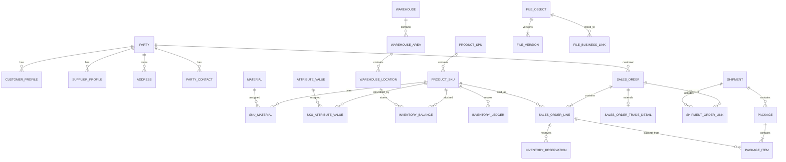

# KAXI ERP 数据模型与数据字典

> 存放位置：`docs/baseline/`

> 文档状态：现行合并基线 V0.3
> 整理日期：2026-08-22
> 文档职责：定义逻辑实体、字段、约束、索引和 PostgreSQL 物理模型
> 最近复核：2026-08-24
> 规则：本文件是数据模型与数据字典的唯一现行合并基线；正式已确认决策优先于待确认建议，合并前来源仅通过 Git 历史追溯。

---

## 第1编｜KAXI_ERP_数据库实体关系模型_V0.1

> 状态：概念/逻辑模型草案  
> 目标数据库：PostgreSQL（已确认作为唯一交易事实源）  
> 设计原则：统一主数据、统一库存、统一订单核心，内销与外贸采用扩展模型

已确认主体原则：当前内销与外贸属于同一公司主体；数据模型从第一天支持多公司主体，V1.0先启用当前主体。

### 1. 总体模块

```text
系统与权限
├── 用户/岗位/角色
├── 用户级单独授权
└── 审计日志

文件中心
├── 文件对象/版本
├── 分类/标签
├── 业务关联
└── 分享/保留/审计

主数据
├── 商品/SPU/SKU/材质/属性
├── 客户/代理/供应商
├── 国家/币种/汇率/贸易术语
└── 仓库/库区/货架/库位

交易核心
├── 销售订单/价格/授信
├── 库存余额/预留/流水
├── 采购/验收/退货
├── 生产/BOM/领料/质检
├── 预包装/预售/穿透
├── 装箱/出运/外贸单证
└── 应收/应付/收付款/结算
```

### 2. 关键架构关系



### 3. 系统与权限模型

#### 3.1 核心表

| 表 | 作用 |
|---|---|
| `sys_user` | 用户账号及状态 |
| `sys_department` | 部门层级 |
| `sys_position` | 岗位 |
| `sys_role` | 角色 |
| `sys_permission` | 原子权限定义 |
| `sys_user_role` | 用户与角色关系 |
| `sys_role_permission` | 角色权限 |
| `sys_user_permission_override` | 用户级追加、限制和临时权限 |
| `sys_data_scope` | 仓库、客户、渠道等数据范围 |
| `sys_approval_rule` | 审批规则、阈值和审批路径 |
| `sys_audit_log` | 操作和数据变化审计 |

#### 3.2 用户权限计算

```text
用户最终权限
= 角色权限并集
+ 用户级允许授权
- 用户级明确禁止
```

强制职责分离规则优先级高于普通追加授权。高风险用户级授权可要求二次审批。

### 4. 文件中心模型

| 表 | 作用 |
|---|---|
| `file_object` | 一个逻辑文件 |
| `file_version` | 文件的各个物理版本 |
| `file_category` | 可配置文件分类 |
| `file_tag` | 标签 |
| `file_object_tag` | 文件与标签关系 |
| `file_business_link` | 文件与任意业务对象关系 |
| `file_permission` | 文件级授权 |
| `file_share_link` | 有效期、密码和下载控制 |
| `file_retention_policy` | 保留、归档和销毁规则 |
| `file_audit_log` | 上传、查看、下载、分享、恢复等审计 |

#### 4.1 文件关系

- `file_object` 代表逻辑文件，保持稳定业务标识。
- `file_version` 保存每次上传或重新生成的对象存储键和哈希。
- `file_business_link` 使用业务对象类型和对象 ID 关联商品、订单、出运等数据。
- 当前版本由 `file_object.current_version_id` 指向，历史版本不覆盖。

### 5. 组织、客户与供应商模型

使用统一业务伙伴 `party`，避免同一公司既是客户又是供应商时重复维护。

| 表 | 作用 |
|---|---|
| `party` | 个人或组织主体 |
| `customer_profile` | 客户扩展资料 |
| `supplier_profile` | 供应商扩展资料 |
| `agent_profile` | 代理等级、授信等扩展 |
| `party_contact` | 联系人 |
| `address` | 账单、收货及注册地址 |
| `party_bank_account` | 银行账户（敏感） |
| `party_tax_profile` | 国内/海外税务身份 |
| `customer_assignment` | 客户归属业务员和协作关系 |

`party` 可同时拥有客户、供应商和代理扩展，但各种业务状态独立控制。

### 6. 商品主数据模型

| 表 | 作用 |
|---|---|
| `product_spu` | 商品系列及共用资料 |
| `product_sku` | 可独立采购、库存、销售和生产的单品 |
| `product_category` | 商品分类树 |
| `brand` | 品牌 |
| `material` | 材质档案 |
| `sku_material` | SKU 与材质多对多关系及含量/用量 |
| `attribute` | 属性定义 |
| `attribute_value` | 属性值 |
| `sku_attribute_value` | SKU 属性组合 |
| `sku_barcode` | SKU 多条码/二维码值 |
| `product_trade_profile` | 中文/英文品名、HS编码、申报信息 |
| `product_package_spec` | 单件重量、体积和包装规格 |

内部主键使用 BIGINT；`sku_code` 为业务唯一编码；条码独立建表，不作为主键。

### 7. 仓库与库存模型

| 表 | 作用 |
|---|---|
| `warehouse` | 仓库主数据 |
| `warehouse_area` | 产品区、预包装区等库区 |
| `warehouse_rack` | 可选货架层 |
| `warehouse_location` | 最终库存库位 |
| `inventory_status` | 可售、新品、异常等状态字典 |
| `inventory_balance` | SKU+库位+状态的当前余额 |
| `inventory_ledger` | 不可无痕修改的库存流水 |
| `inventory_reservation` | 物理库存预留 |
| `oversell_policy` | 穿透额度和适用范围 |
| `oversell_commitment` | 穿透占用记录 |
| `stock_transfer` | 调拨单 |
| `stock_transfer_line` | 调拨明细 |
| `stock_count` | 盘点单 |
| `stock_count_line` | 盘点及差异明细 |
| `stock_adjustment` | 经审批的库存调整单 |

#### 7.1 库存余额唯一维度

普通数量库存建议唯一键：

```text
(company_id, sku_id, warehouse_id, location_id, inventory_status_id, lot_id)
```

没有批次时 `lot_id` 使用统一的无批次表达方式，避免 NULL 唯一性歧义。

#### 7.2 库存流水

流水至少保存：业务类型、业务单号、SKU、原/目标仓库与库位、状态、数量、余额前后值、发生时间、操作者和幂等键。

### 8. 单件编号模型

| 表 | 作用 |
|---|---|
| `limited_edition_pool` | SKU 限量池 |
| `product_serial` | 单件编号及当前状态 |
| `serial_production_attempt` | 同一编号的多次生产尝试 |
| `serial_status_history` | 编号状态历史 |
| `serial_reservation` | 指定或自动分配编号的锁定记录 |

关键约束：`(limited_edition_pool_id, serial_no)` 唯一；NG重生产增加尝试记录，不新增限量占用。

### 9. 销售、价格与授信模型

| 表 | 作用 |
|---|---|
| `sales_channel` | 平台、代理、私域等渠道 |
| `trade_type` | 内销、一般贸易、跨境电商等 |
| `sales_order` | 统一销售订单头 |
| `sales_order_line` | 订单明细及行状态 |
| `sales_order_status_history` | 订单状态历史 |
| `sales_order_change` | 已确认订单的受控变更 |
| `price_list` | 价格表头、币种和有效期 |
| `price_list_item` | SKU 价格 |
| `agent_level` | 代理等级 |
| `agent_discount_rule` | SKU/品类的等级折扣 |
| `customer_special_price` | 客户/SKU特殊价格 |
| `credit_account` | 客户授信额度和状态 |
| `credit_commitment` | 订单授信占用与释放 |

渠道与贸易类型必须分开保存。订单确认后保存价格、折扣、币种、税率及汇率快照。

### 10. 内外贸扩展模型

| 表 | 作用 |
|---|---|
| `country_region` | 国家/地区 |
| `currency` | 币种 |
| `exchange_rate` | 按日期和来源保存汇率 |
| `incoterm` | 贸易术语及版本 |
| `sales_order_trade_detail` | 订单贸易、港口、运输及付款扩展 |
| `shipment` | 出运批次 |
| `shipment_order_link` | 出运与订单多对多关系 |
| `shipment_line` | 本批实际出运明细 |
| `package` | 箱号、重量、体积、唛头 |
| `package_item` | 箱内SKU/编号/数量 |
| `trade_document` | 单证类型、编号、状态及文件版本 |
| `trade_charge` | 运费、保险、报关及其他费用 |

订单与出运多对多；箱号属于出运批次；编号型商品在 `package_item` 中精确关联 `product_serial_id`。

### 11. 采购与验收模型

| 表 | 作用 |
|---|---|
| `purchase_order` | 采购订单 |
| `purchase_order_line` | 采购明细 |
| `goods_receipt` | 到货/收货记录 |
| `goods_receipt_line` | 实收数量 |
| `quality_inspection` | 质检单 |
| `quality_inspection_line` | 合格、NG、待判定数量 |
| `purchase_return` | 采购退货 |
| `purchase_return_line` | 退货明细 |
| `supplier_sku` | 供应商与SKU、价格、周期关系 |

采购订单不直接增加库存；验收处置和入库动作生成库存流水。

### 12. 生产与BOM模型

| 表 | 作用 |
|---|---|
| `bom` | BOM头和版本 |
| `bom_item` | 材料、半成品及标准用量 |
| `production_order` | 生产订单 |
| `production_material_plan` | 需求和预留材料 |
| `material_issue` | 领料单 |
| `material_issue_line` | 实际领料 |
| `material_return` | 退料 |
| `production_completion` | 完工和产量 |
| `production_consumption` | 实际消耗及损耗 |
| `production_inspection` | 生产质检 |

BOM 历史版本不可覆盖；生产订单保存所用 BOM 版本快照。

### 13. 预包装模型

| 表 | 作用 |
|---|---|
| `packaging_plan` | 包装方案 |
| `packaging_plan_item` | 包装物料标准用量 |
| `prepack_order` | 预包装任务 |
| `prepack_order_line` | 产品及数量 |
| `prepack_material_usage` | 包装物料实际消耗 |
| `prepack_breakdown` | 拆包记录及损耗 |

预包装完成后通过库存状态转换形成预包装库存，不另外伪造 SKU。

### 14. 财务与结算模型

已确认：KAXI V1.0自建完整复式记账财务系统；当前主体记账本位币为CNY。

| 表 | 作用 |
|---|---|
| `accounts_receivable` | 应收单及原币/本位币金额 |
| `accounts_payable` | 应付单 |
| `receipt` | 收款记录 |
| `receipt_allocation` | 收款核销至应收 |
| `payment` | 付款记录 |
| `payment_allocation` | 付款核销至应付 |
| `settlement_statement` | 平台、代理、货代等结算单 |
| `cost_record` | 商品、库存、生产和包装成本记录 |
| `financial_reversal` | 红冲、反结算和原因链 |
| `chart_of_accounts` | 会计科目表及版本 |
| `account` | 会计科目 |
| `fiscal_period` | 会计期间和锁定状态 |
| `journal_entry` | 会计凭证头 |
| `journal_entry_line` | 借贷分录和辅助核算 |
| `posting_rule` | 业务单据到凭证的过账规则 |
| `account_balance` | 科目余额加速查询 |
| `financial_statement_template` | 财务报表模板和科目映射 |
| `accounting_standard` | 可选会计准则/制度字典 |
| `company_accounting_policy` | 公司主体会计政策及有效期版本 |
| `taxpayer_type` | 可选纳税人类型字典 |
| `company_tax_profile` | 公司主体税务配置及有效期版本 |
| `tax_code` | 税码、税率和适用条件 |

完整总账已纳入V1.0。业务单据产生可审计的会计事件，经规则生成凭证；已过账凭证不得直接删除，使用冲销和更正流程。

#### 14.1 财务外围子账扩展

| 领域 | 核心表 | 主要关系 |
|---|---|---|
| 应收 | `receivable_item`、`receivable_schedule`、`customer_receipt`、`receipt_allocation`、`bad_debt_assessment` | 销售/合同产生应收；收款通过核销表多对多关联应收；坏账评估引用应收余额快照 |
| 授信 | `customer_credit_profile`、`credit_exposure` | 授信版本属于客户和公司；占用明细引用订单、应收或例外审批 |
| 应付 | `payable_item`、`payable_schedule`、`supplier_invoice`、`three_way_match` | 采购订单、收货与发票通过匹配结果关联；应付区分暂估和正式发票 |
| 付款 | `payment_request`、`supplier_payment`、`payment_allocation` | 申请与支付分离；付款通过核销表多对多关联应付 |
| 费用 | `expense_policy`、`expense_request`、`employee_advance`、`expense_claim`、`expense_line`、`expense_allocation` | 报销引用事前申请和借款；费用行按成本对象分摊 |
| 固定资产 | `asset_category`、`fixed_asset`、`asset_component`、`asset_transaction`、`depreciation_run`、`depreciation_line`、`asset_inventory` | 资产卡片引用来源业务；全部生命周期变化写入交易表；折旧批次产生明细和会计事件 |
| 薪资 | `payroll_period`、`payroll_item`、`payroll_rule`、`employee_pay_profile`、`payroll_run`、`payroll_result`、`payroll_cost_allocation` | 薪资批次按员工生成结果；结果按生产订单、部门或项目分配 |
| 税务发票 | `tax_type`、`tax_code`、`party_invoice_profile`、`product_tax_mapping`、`sales_invoice_request`、`sales_invoice`、`purchase_invoice`、`tax_ledger_entry`、`tax_return_workpaper` | 税务主数据版本驱动业务税额；发票关联业务和税务台账；底稿汇总台账但不覆盖明细 |
| 银行结算 | `bank_account`、`party_bank_account`、`employee_bank_account`、`bank_transaction`、`settlement_allocation` | 银行流水幂等导入；结算分配关联应收、应付、报销或薪资 |

#### 14.2 关键关系基数

```text
sales_order / contract 1 ── N receivable_item
customer_receipt       N ── N receivable_item       (receipt_allocation)
customer               1 ── N customer_credit_profile
purchase_order         1 ── N goods_receipt
purchase_order         N ── N supplier_invoice      (three_way_match)
supplier_payment       N ── N payable_item          (payment_allocation)
expense_claim          1 ── N expense_line
expense_line           1 ── N expense_allocation
fixed_asset            1 ── N asset_transaction
depreciation_run       1 ── N depreciation_line
payroll_run            1 ── N payroll_result
payroll_result         1 ── N payroll_cost_allocation
sales_invoice          1 ── N tax_ledger_entry
purchase_invoice       1 ── N tax_ledger_entry
accounting_event       0..1 ── 1 journal_entry
```

#### 14.3 财务唯一性与余额约束

- `receipt_allocation` 与 `payment_allocation` 的有效分配合计不得超过资金可用金额或债权债务余额。
- 公司银行流水以 `(bank_account_id, source_system, external_transaction_id)` 唯一。
- 供应商发票和进项发票使用开票主体、号码、代码、日期、金额及税额组合查重。
- 每个公司、账簿、会计期间、折旧账册只允许一个有效的已过账折旧批次。
- 每个公司、薪资组、薪资期间只允许一个正常有效的已锁定薪资批次；更正使用独立更正批次。
- 税码、纳税配置、费用政策、折旧政策和薪资规则的生效区间不得重叠。
- 应收、应付、资产、薪资与税务子账均须保存会计事件引用，并可与总账重建核对。

### 15. 通用字段约定

业务表原则上包含：

```text
id BIGINT
company_id BIGINT
business_no VARCHAR
status VARCHAR或状态ID
created_at TIMESTAMPTZ
created_by BIGINT
updated_at TIMESTAMPTZ
updated_by BIGINT
version_no INTEGER
```

- 金额使用 `NUMERIC`，禁止浮点数。
- 数量和重量使用可配置精度的 `NUMERIC`。
- 时间使用带时区时间戳，展示时转换为用户时区。
- 业务单号唯一但不作为主键。
- 关键交易表不使用简单物理删除。
- 外部同步记录保存来源系统、外部ID和幂等键。

### 16. 并发与一致性边界

- 库存预留、释放和出库必须锁定对应余额行或使用等效原子条件更新。
- 指定编号通过唯一约束和事务锁防止重复占用。
- 授信占用与订单确认在同一事务边界内完成。
- 接口同步以 `(source_system, external_id)` 唯一约束去重。
- 文件版本切换保证同一逻辑文件只有一个当前版本。
- 收付款反核销使用反向记录，不覆盖原交易。

---

## 第2编｜KAXI_ERP_核心数据字典_V0.1

> 状态：字段级设计草案  
> 范围：权限、文件、业务伙伴、商品、仓库、销售、内外贸及库存核心表

### 1. 字段类型约定

| 逻辑类型 | PostgreSQL建议 | 说明 |
|---|---|---|
| 主键 | `BIGINT` | 内部ID |
| 业务编码 | `VARCHAR` | 唯一但不作为主键 |
| 金额 | `NUMERIC(20,6)` | 最终精度待财务确认 |
| 数量 | `NUMERIC(20,6)` | 支持件、克等单位 |
| 汇率 | `NUMERIC(20,10)` | 保留足够精度 |
| 时间 | `TIMESTAMPTZ` | 统一保存绝对时间 |
| 日期 | `DATE` | 无具体时间的业务日期 |
| 状态 | `VARCHAR(32)` | 初期可读，后续可配合字典约束 |
| 扩展属性 | `JSONB` | 仅用于非核心、不稳定字段 |

所有外键字段必须建立与查询场景匹配的索引；唯一业务规则必须由数据库唯一约束保护，不能只依赖页面校验。

### 2. `sys_user` 用户

| 字段 | 类型 | 必填 | 约束/说明 |
|---|---|---:|---|
| id | BIGINT | 是 | 主键 |
| username | VARCHAR(100) | 是 | 唯一登录名 |
| display_name | VARCHAR(200) | 是 | 显示名称 |
| employee_no | VARCHAR(100) | 否 | 员工编号，启用时唯一 |
| department_id | BIGINT | 否 | 部门 |
| position_id | BIGINT | 否 | 岗位 |
| email | VARCHAR(320) | 否 | 邮箱 |
| mobile | VARCHAR(50) | 否 | 手机号 |
| timezone | VARCHAR(64) | 是 | 默认 Asia/Shanghai |
| locale | VARCHAR(20) | 是 | 语言区域 |
| status | VARCHAR(32) | 是 | invited/active/locked/disabled |
| last_login_at | TIMESTAMPTZ | 否 | 最近登录 |
| created_at/by | 通用 | 是 | 审计字段 |

密码哈希和认证凭据应使用独立安全字段/认证组件管理，不在日志中输出。

### 3. `sys_user_permission_override` 用户级权限

| 字段 | 类型 | 必填 | 约束/说明 |
|---|---|---:|---|
| id | BIGINT | 是 | 主键 |
| user_id | BIGINT | 是 | 被授权用户 |
| permission_id | BIGINT | 是 | 原子权限 |
| effect | VARCHAR(16) | 是 | allow/deny |
| data_scope_type | VARCHAR(50) | 否 | warehouse/customer/channel等 |
| data_scope_value | JSONB | 否 | 明确范围，不保存任意执行表达式 |
| starts_at | TIMESTAMPTZ | 是 | 生效时间 |
| expires_at | TIMESTAMPTZ | 否 | 临时权限到期时间 |
| reason | TEXT | 是 | 授权原因 |
| approval_status | VARCHAR(32) | 是 | 高风险权限审批状态 |
| approved_by/at | 通用 | 否 | 审批记录 |
| revoked_by/at | 通用 | 否 | 撤销记录 |
| created_by/at | 通用 | 是 | 必须审计 |

有效权限查询需排除未生效、已过期、已撤销和审批未通过记录。

### 4. `file_object` 逻辑文件

| 字段 | 类型 | 必填 | 约束/说明 |
|---|---|---:|---|
| id | BIGINT | 是 | 主键 |
| file_no | VARCHAR(50) | 是 | 唯一业务编号 |
| title | VARCHAR(500) | 是 | 业务标题 |
| category_id | BIGINT | 是 | 文件分类 |
| security_level | VARCHAR(16) | 是 | L1/L2/L3/L4 |
| status | VARCHAR(32) | 是 | draft/active/void/archived/recycled |
| current_version_id | BIGINT | 否 | 当前有效版本，循环外键需延迟处理 |
| owner_user_id | BIGINT | 是 | 负责人 |
| retention_policy_id | BIGINT | 否 | 保留策略 |
| valid_from/to | DATE | 否 | 合同/证书等有效期 |
| description | TEXT | 否 | 说明 |
| created_at/by | 通用 | 是 | 审计 |

### 5. `file_version` 文件版本

| 字段 | 类型 | 必填 | 约束/说明 |
|---|---|---:|---|
| id | BIGINT | 是 | 主键 |
| file_object_id | BIGINT | 是 | 逻辑文件 |
| version_no | INTEGER | 是 | 对同一文件唯一 |
| original_filename | VARCHAR(500) | 是 | 原文件名 |
| storage_provider | VARCHAR(50) | 是 | minio/s3等 |
| storage_key | VARCHAR(1000) | 是 | 对象存储键，唯一 |
| mime_type | VARCHAR(200) | 是 | MIME类型 |
| extension | VARCHAR(32) | 否 | 扩展名 |
| size_bytes | BIGINT | 是 | 文件大小 |
| sha256 | CHAR(64) | 是 | 完整性/重复检测 |
| scan_status | VARCHAR(32) | 是 | pending/clean/quarantined/failed |
| source_type | VARCHAR(32) | 是 | upload/generated/imported |
| template_version | VARCHAR(50) | 否 | 系统生成单证模板版本 |
| business_snapshot | JSONB | 否 | 生成时的数据快照或快照引用 |
| change_reason | TEXT | 否 | 新版本原因 |
| created_at/by | 通用 | 是 | 审计 |

唯一约束：`(file_object_id, version_no)`。

### 6. `file_business_link` 文件业务关联

| 字段 | 类型 | 必填 | 说明 |
|---|---|---:|---|
| id | BIGINT | 是 | 主键 |
| file_object_id | BIGINT | 是 | 逻辑文件 |
| object_type | VARCHAR(80) | 是 | sku/sales_order/shipment等受控类型 |
| object_id | BIGINT | 是 | 业务对象ID |
| relation_type | VARCHAR(50) | 是 | attachment/contract/evidence等 |
| is_primary | BOOLEAN | 是 | 是否主要文件 |
| created_at/by | 通用 | 是 | 审计 |

唯一约束建议：`(file_object_id, object_type, object_id, relation_type)`。

### 7. `party` 业务伙伴

| 字段 | 类型 | 必填 | 说明 |
|---|---|---:|---|
| id | BIGINT | 是 | 主键 |
| party_no | VARCHAR(50) | 是 | 唯一编码 |
| party_type | VARCHAR(16) | 是 | organization/person |
| legal_name | VARCHAR(300) | 是 | 法定/正式名称 |
| display_name | VARCHAR(300) | 是 | 显示名称 |
| country_region_id | BIGINT | 否 | 注册国家/地区 |
| default_language | VARCHAR(20) | 否 | 默认沟通语言 |
| default_currency_id | BIGINT | 否 | 默认币种 |
| status | VARCHAR(32) | 是 | draft/active/suspended/inactive |
| risk_level | VARCHAR(32) | 否 | 风险等级 |
| created_at/by | 通用 | 是 | 审计 |

### 8. `agent_profile` 代理扩展

| 字段 | 类型 | 必填 | 说明 |
|---|---|---:|---|
| party_id | BIGINT | 是 | 主键兼外键 |
| agent_level_id | BIGINT | 是 | 当前等级 |
| price_list_id | BIGINT | 否 | 默认价格表 |
| credit_account_id | BIGINT | 否 | 授信账户 |
| owner_user_id | BIGINT | 否 | 跟单负责人 |
| effective_from/to | DATE | 否 | 代理关系有效期 |
| status | VARCHAR(32) | 是 | active/suspended/terminated |

### 9. `product_spu` 与 `product_sku`

#### `product_spu`

| 字段 | 类型 | 必填 | 说明 |
|---|---|---:|---|
| id | BIGINT | 是 | 主键 |
| spu_code | VARCHAR(100) | 是 | 唯一 |
| name_zh | VARCHAR(500) | 是 | 中文名称 |
| name_en | VARCHAR(500) | 否 | 英文名称 |
| category_id | BIGINT | 是 | 分类 |
| brand_id | BIGINT | 否 | 品牌 |
| status | VARCHAR(32) | 是 | draft/active/inactive |
| extension_data | JSONB | 否 | 非核心扩展 |

#### `product_sku`

| 字段 | 类型 | 必填 | 说明 |
|---|---|---:|---|
| id | BIGINT | 是 | 主键 |
| sku_code | VARCHAR(100) | 是 | 全局唯一业务编码 |
| spu_id | BIGINT | 是 | 所属SPU |
| name_zh | VARCHAR(500) | 是 | 中文名称 |
| name_en | VARCHAR(500) | 否 | 英文名称 |
| base_uom_id | BIGINT | 是 | 基本计量单位 |
| is_serialized | BOOLEAN | 是 | 是否单件编号管理 |
| is_limited_edition | BOOLEAN | 是 | 是否限量 |
| allow_oversell | BOOLEAN | 是 | 是否允许穿透策略 |
| status | VARCHAR(32) | 是 | draft/active/inactive/discontinued |
| created_at/by | 通用 | 是 | 审计 |

### 10. `product_trade_profile` 商品贸易资料

| 字段 | 类型 | 必填 | 说明 |
|---|---|---:|---|
| id | BIGINT | 是 | 主键 |
| sku_id | BIGINT | 是 | SKU |
| country_region_id | BIGINT | 否 | 特定目的国；空表示通用 |
| language | VARCHAR(20) | 是 | 资料语言 |
| declared_name | VARCHAR(500) | 是 | 申报品名 |
| hs_code | VARCHAR(50) | 否 | HS编码 |
| origin_country_id | BIGINT | 否 | 原产国 |
| declaration_uom_id | BIGINT | 否 | 申报单位 |
| declaration_elements | JSONB | 否 | 结构化申报要素 |
| net_weight | NUMERIC(20,6) | 否 | 单件净重 |
| gross_weight | NUMERIC(20,6) | 否 | 单件毛重 |
| volume | NUMERIC(20,6) | 否 | 单件体积 |
| valid_from/to | DATE | 否 | 有效期 |

唯一约束建议：`(sku_id, country_region_id, language, valid_from)`。

### 11. `warehouse_location` 库位

| 字段 | 类型 | 必填 | 说明 |
|---|---|---:|---|
| id | BIGINT | 是 | 主键 |
| warehouse_id | BIGINT | 是 | 仓库 |
| area_id | BIGINT | 是 | 库区 |
| rack_id | BIGINT | 否 | 货架 |
| location_code | VARCHAR(100) | 是 | 仓库内唯一 |
| location_type | VARCHAR(32) | 是 | storage/staging/inspection/exception等 |
| allow_mixed_sku | BOOLEAN | 是 | 是否混放 |
| capacity_qty/weight/volume | NUMERIC | 否 | 容量限制 |
| status | VARCHAR(32) | 是 | active/blocked/inactive |

唯一约束：`(warehouse_id, location_code)`。

### 12. `inventory_balance` 库存余额

| 字段 | 类型 | 必填 | 说明 |
|---|---|---:|---|
| id | BIGINT | 是 | 主键 |
| company_id | BIGINT | 是 | 公司主体 |
| sku_id | BIGINT | 是 | SKU |
| warehouse_id | BIGINT | 是 | 仓库 |
| location_id | BIGINT | 是 | 库位 |
| inventory_status_id | BIGINT | 是 | 库存状态 |
| lot_id | BIGINT | 是 | 无批次也使用指定值 |
| on_hand_qty | NUMERIC(20,6) | 是 | 实际在手量 |
| reserved_qty | NUMERIC(20,6) | 是 | 物理库存已预留量 |
| locked_qty | NUMERIC(20,6) | 是 | 质检/异常等锁定量 |
| available_qty | NUMERIC(20,6) | 是 | 可用量，可保存或受控计算 |
| row_version | BIGINT | 是 | 乐观锁版本 |
| updated_at | TIMESTAMPTZ | 是 | 最近变化 |

唯一约束：`(company_id, sku_id, warehouse_id, location_id, inventory_status_id, lot_id)`。

### 13. `inventory_ledger` 库存流水

| 字段 | 类型 | 必填 | 说明 |
|---|---|---:|---|
| id | BIGINT | 是 | 主键，未来大表 |
| company_id | BIGINT | 是 | 公司主体 |
| occurred_at | TIMESTAMPTZ | 是 | 业务发生时间 |
| sku_id | BIGINT | 是 | SKU |
| warehouse_id/location_id | BIGINT | 是 | 当前维度 |
| inventory_status_id | BIGINT | 是 | 状态 |
| lot_id | BIGINT | 是 | 批次维度 |
| transaction_type | VARCHAR(50) | 是 | receipt/ship/transfer等 |
| quantity_delta | NUMERIC(20,6) | 是 | 正负变化 |
| before_qty/after_qty | NUMERIC(20,6) | 是 | 变化前后 |
| reference_type | VARCHAR(80) | 是 | 来源单据类型 |
| reference_id | BIGINT | 是 | 来源ID |
| reference_no | VARCHAR(100) | 是 | 来源业务号快照 |
| idempotency_key | VARCHAR(200) | 是 | 唯一幂等键 |
| operator_id | BIGINT | 是 | 操作人 |
| created_at | TIMESTAMPTZ | 是 | 写入时间 |

`idempotency_key` 唯一。流水原则上追加写，不允许普通业务更新和删除。

### 14. `inventory_reservation` 库存预留

| 字段 | 类型 | 必填 | 说明 |
|---|---|---:|---|
| id | BIGINT | 是 | 主键 |
| reservation_no | VARCHAR(100) | 是 | 唯一编号 |
| sales_order_line_id | BIGINT | 是 | 订单行 |
| sku_id | BIGINT | 是 | SKU |
| warehouse_id | BIGINT | 是 | 仓库 |
| location_id | BIGINT | 否 | 可延迟到拣货分配 |
| inventory_status_id | BIGINT | 是 | 预留库存状态 |
| reserved_qty | NUMERIC(20,6) | 是 | 预留数量 |
| consumed_qty | NUMERIC(20,6) | 是 | 已用于出库 |
| released_qty | NUMERIC(20,6) | 是 | 已释放 |
| status | VARCHAR(32) | 是 | active/consumed/released/expired |
| expires_at | TIMESTAMPTZ | 否 | 失效时间 |
| created_at/by | 通用 | 是 | 审计 |

约束：`reserved_qty = consumed_qty + released_qty + 当前有效剩余量`。

### 15. `sales_order` 销售订单

| 字段 | 类型 | 必填 | 说明 |
|---|---|---:|---|
| id | BIGINT | 是 | 主键 |
| order_no | VARCHAR(100) | 是 | 全局或公司内唯一 |
| company_id | BIGINT | 是 | 销售主体 |
| customer_party_id | BIGINT | 是 | 客户 |
| channel_id | BIGINT | 是 | 销售渠道 |
| trade_type_id | BIGINT | 是 | 贸易类型 |
| external_order_id | VARCHAR(200) | 否 | 平台外部ID |
| order_date | TIMESTAMPTZ | 是 | 下单时间 |
| currency_id | BIGINT | 是 | 成交币种 |
| exchange_rate | NUMERIC(20,10) | 是 | 订单锁定汇率 |
| price_tax_mode | VARCHAR(20) | 是 | tax_included/excluded |
| subtotal/discount/tax/total | NUMERIC(20,6) | 是 | 原币金额 |
| base_total | NUMERIC(20,6) | 是 | 本位币金额 |
| payment_term_id | BIGINT | 否 | 付款条件 |
| shipping_address_id | BIGINT | 是 | 收货地址快照引用/快照 |
| status | VARCHAR(32) | 是 | 与订单状态机一致 |
| credit_check_status | VARCHAR(32) | 是 | 授信校验状态 |
| inventory_status | VARCHAR(32) | 是 | 预留汇总状态 |
| version_no | INTEGER | 是 | 受控变更版本 |
| created_at/by | 通用 | 是 | 审计 |

平台订单唯一约束建议：`(channel_id, external_order_id)`，外部ID为空时不适用。

### 16. `sales_order_line` 订单明细

| 字段 | 类型 | 必填 | 说明 |
|---|---|---:|---|
| id | BIGINT | 是 | 主键 |
| sales_order_id | BIGINT | 是 | 订单头 |
| line_no | INTEGER | 是 | 订单内唯一 |
| sku_id | BIGINT | 是 | SKU |
| ordered_qty | NUMERIC(20,6) | 是 | 订购数量 |
| reserved_qty | NUMERIC(20,6) | 是 | 已预留 |
| picked_qty | NUMERIC(20,6) | 是 | 已拣货 |
| shipped_qty | NUMERIC(20,6) | 是 | 已发货 |
| cancelled_qty | NUMERIC(20,6) | 是 | 已取消 |
| returned_qty | NUMERIC(20,6) | 是 | 已退货 |
| unit_price | NUMERIC(20,6) | 是 | 原币单价快照 |
| discount_rate | NUMERIC(12,6) | 是 | 折扣 |
| tax_rate | NUMERIC(12,6) | 是 | 税率 |
| line_total/base_line_total | NUMERIC | 是 | 原币/本位币金额 |
| status | VARCHAR(32) | 是 | 行状态 |
| requested_serial_no | VARCHAR(100) | 否 | 指定编号需求；实际关联另表 |

数量平衡和不可为负由检查约束与业务事务共同保证。

### 17. `sales_order_trade_detail` 贸易扩展

| 字段 | 类型 | 必填 | 说明 |
|---|---|---:|---|
| sales_order_id | BIGINT | 是 | 主键兼外键 |
| incoterm_id | BIGINT | 否 | 内销可空 |
| incoterm_place | VARCHAR(300) | 否 | 指定地点/港口 |
| origin_place/port | VARCHAR(300) | 否 | 起运信息 |
| destination_port | VARCHAR(300) | 否 | 目的港 |
| final_destination | VARCHAR(500) | 否 | 最终目的地 |
| transport_mode | VARCHAR(32) | 否 | express/air/sea/rail等 |
| freight_forwarder_party_id | BIGINT | 否 | 货代 |
| planned_ship_date | DATE | 否 | 计划出运 |
| requested_delivery_date | DATE | 否 | 期望交付 |
| deposit_rate | NUMERIC(12,6) | 否 | 定金比例 |
| declaration_currency_id | BIGINT | 否 | 申报币种 |
| remarks | TEXT | 否 | 贸易备注 |

### 18. `shipment` 出运批次

| 字段 | 类型 | 必填 | 说明 |
|---|---|---:|---|
| id | BIGINT | 是 | 主键 |
| shipment_no | VARCHAR(100) | 是 | 唯一编号 |
| company_id | BIGINT | 是 | 主体 |
| trade_type_id | BIGINT | 是 | 贸易类型 |
| transport_mode | VARCHAR(32) | 是 | 运输方式 |
| forwarder_party_id | BIGINT | 否 | 货代 |
| carrier_name | VARCHAR(300) | 否 | 承运人 |
| tracking_or_booking_no | VARCHAR(200) | 否 | 运单/订舱号 |
| planned/actual_ship_at | TIMESTAMPTZ | 否 | 计划/实际出运 |
| estimated/actual_arrival_at | TIMESTAMPTZ | 否 | 到达时间 |
| origin/destination | VARCHAR(500) | 否 | 起止地点 |
| package_count | INTEGER | 是 | 箱数汇总 |
| gross_weight/net_weight/volume | NUMERIC | 是 | 汇总 |
| status | VARCHAR(32) | 是 | 与出运状态机一致 |
| created_at/by | 通用 | 是 | 审计 |

### 19. `package` 与 `package_item`

#### `package`

| 字段 | 类型 | 必填 | 说明 |
|---|---|---:|---|
| id | BIGINT | 是 | 主键 |
| shipment_id | BIGINT | 是 | 出运批次 |
| package_no | VARCHAR(100) | 是 | 批次内唯一箱号 |
| package_type | VARCHAR(50) | 否 | 箱/托盘等 |
| length/width/height | NUMERIC | 否 | 尺寸及单位 |
| net_weight/gross_weight | NUMERIC | 否 | 重量 |
| volume | NUMERIC | 否 | 体积 |
| shipping_mark | VARCHAR(500) | 否 | 唛头 |
| status | VARCHAR(32) | 是 | packing/reviewed/sealed/shipped |

#### `package_item`

| 字段 | 类型 | 必填 | 说明 |
|---|---|---:|---|
| id | BIGINT | 是 | 主键 |
| package_id | BIGINT | 是 | 箱 |
| sales_order_line_id | BIGINT | 是 | 来源订单行 |
| sku_id | BIGINT | 是 | SKU快照关联 |
| product_serial_id | BIGINT | 否 | 编号型商品必填 |
| quantity | NUMERIC(20,6) | 是 | 数量 |

编号型商品约束 `quantity=1`，并保证同一编号不能出现在两个有效箱明细中。

### 20. 后续字典范围

下一批详细字段：

- 采购、收货、质检和采购退货
- BOM、生产、领退料、完工和损耗
- 预包装、拆包、穿透和预售
- 限量池、编号及生产尝试
- 应收、应付、收付款、核销和结算
- 价格表、代理折扣和授信账户
- 审批规则、状态历史和外部接口日志

---

## 第3编｜KAXI_ERP_业务数据字典_V0.1

> 状态：字段级设计草案  
> 本册范围：价格授信、采购质检、生产BOM、预包装穿透、限量编号、财务结算、审批及接口

### 1. 通用约定

- 主键使用 `BIGINT`，业务编号唯一但不作为主键。
- 金额使用 `NUMERIC(20,6)`，汇率使用 `NUMERIC(20,10)`。
- 数量、重量和损耗使用 `NUMERIC(20,6)`，最终精度按计量单位配置。
- 时间使用 `TIMESTAMPTZ`；业务日期使用 `DATE`。
- 交易表包含 `company_id`、状态、创建/更新人与时间、版本号。
- 已生效交易不物理删除，取消、红冲和反结算使用独立记录。
- 所有状态必须与《KAXI ERP 核心业务状态机》一致。

### 2. 价格体系

#### 2.1 `price_list` 价格表

| 字段 | 类型 | 必填 | 说明 |
|---|---|---:|---|
| id | BIGINT | 是 | 主键 |
| price_list_no | VARCHAR(100) | 是 | 唯一编号 |
| name | VARCHAR(300) | 是 | 价格表名称 |
| company_id | BIGINT | 是 | 公司主体 |
| currency_id | BIGINT | 是 | 币种 |
| trade_type_id | BIGINT | 否 | 内销/外贸等；空表示通用 |
| channel_id | BIGINT | 否 | 渠道；空表示通用 |
| customer_type | VARCHAR(32) | 否 | 客户类型 |
| tax_mode | VARCHAR(20) | 是 | tax_included/excluded |
| valid_from/to | TIMESTAMPTZ | 是/否 | 有效期 |
| priority | INTEGER | 是 | 多规则匹配优先级 |
| status | VARCHAR(32) | 是 | draft/active/expired/disabled |
| created_at/by | 通用 | 是 | 审计 |

同一业务范围和有效期重叠时必须按优先级和冲突规则处理，不能随机取价。

#### 2.2 `price_list_item` SKU价格

| 字段 | 类型 | 必填 | 说明 |
|---|---|---:|---|
| id | BIGINT | 是 | 主键 |
| price_list_id | BIGINT | 是 | 价格表 |
| sku_id | BIGINT | 是 | SKU |
| unit_price | NUMERIC(20,6) | 是 | 单价 |
| minimum_price | NUMERIC(20,6) | 否 | 最低金额限制 |
| minimum_discount_rate | NUMERIC(12,6) | 否 | 最低折扣，如0.8 |
| min_qty | NUMERIC(20,6) | 是 | 阶梯数量起点，默认0 |
| max_qty | NUMERIC(20,6) | 否 | 阶梯数量终点 |
| uom_id | BIGINT | 是 | 计量单位 |
| status | VARCHAR(32) | 是 | active/inactive |

唯一约束建议：`(price_list_id, sku_id, min_qty)`。

#### 2.3 `agent_level` 代理等级

| 字段 | 类型 | 必填 | 说明 |
|---|---|---:|---|
| id | BIGINT | 是 | 主键 |
| level_code | VARCHAR(50) | 是 | 唯一编码 |
| name | VARCHAR(200) | 是 | 等级名称 |
| sort_order | INTEGER | 是 | 等级顺序 |
| default_discount_rate | NUMERIC(12,6) | 否 | 默认折扣 |
| status | VARCHAR(32) | 是 | active/inactive |

#### 2.4 `agent_discount_rule` 代理折扣规则

| 字段 | 类型 | 必填 | 说明 |
|---|---|---:|---|
| id | BIGINT | 是 | 主键 |
| agent_level_id | BIGINT | 是 | 代理等级 |
| sku_id | BIGINT | 否 | SKU级规则 |
| product_category_id | BIGINT | 否 | 品类规则；SKU与品类二选一 |
| discount_rate | NUMERIC(12,6) | 是 | 折扣率 |
| valid_from/to | TIMESTAMPTZ | 是/否 | 生效区间 |
| priority | INTEGER | 是 | SKU规则通常高于品类规则 |
| status | VARCHAR(32) | 是 | draft/active/expired |

#### 2.5 `customer_special_price` 客户特殊价格

| 字段 | 类型 | 必填 | 说明 |
|---|---|---:|---|
| id | BIGINT | 是 | 主键 |
| customer_party_id | BIGINT | 是 | 客户 |
| sku_id | BIGINT | 是 | SKU |
| currency_id | BIGINT | 是 | 币种 |
| special_price | NUMERIC(20,6) | 否 | 固定价 |
| special_discount_rate | NUMERIC(12,6) | 否 | 特殊折扣；与固定价二选一 |
| can_break_floor | BOOLEAN | 是 | 是否获批突破底价 |
| approval_id | BIGINT | 否 | 突破时必填 |
| valid_from/to | TIMESTAMPTZ | 是/否 | 有效期 |
| reason | TEXT | 是 | 特价原因 |
| status | VARCHAR(32) | 是 | draft/active/expired/revoked |

订单行保存最终定价结果、命中规则和规则快照，避免价格表更新影响历史订单。

### 3. 授信

#### 3.1 `credit_account` 授信账户

| 字段 | 类型 | 必填 | 说明 |
|---|---|---:|---|
| id | BIGINT | 是 | 主键 |
| customer_party_id | BIGINT | 是 | 客户 |
| company_id | BIGINT | 是 | 公司主体 |
| currency_id | BIGINT | 是 | 授信币种 |
| permanent_limit | NUMERIC(20,6) | 是 | 固定额度 |
| temporary_limit | NUMERIC(20,6) | 是 | 临时额度，默认0 |
| temporary_valid_to | TIMESTAMPTZ | 否 | 临时额度到期 |
| used_amount | NUMERIC(20,6) | 是 | 已占用额度 |
| overdue_amount | NUMERIC(20,6) | 是 | 逾期金额 |
| control_mode | VARCHAR(20) | 是 | warn/block/approval |
| status | VARCHAR(32) | 是 | active/frozen/closed |
| row_version | BIGINT | 是 | 并发控制 |

唯一约束建议：`(customer_party_id, company_id, currency_id)`。

#### 3.2 `credit_commitment` 授信占用

| 字段 | 类型 | 必填 | 说明 |
|---|---|---:|---|
| id | BIGINT | 是 | 主键 |
| credit_account_id | BIGINT | 是 | 授信账户 |
| sales_order_id | BIGINT | 是 | 订单 |
| commitment_type | VARCHAR(32) | 是 | order/ar/temporary等 |
| committed_amount | NUMERIC(20,6) | 是 | 占用金额 |
| released_amount | NUMERIC(20,6) | 是 | 已释放 |
| converted_amount | NUMERIC(20,6) | 是 | 转应收金额 |
| status | VARCHAR(32) | 是 | active/converted/released |
| idempotency_key | VARCHAR(200) | 是 | 唯一防重复 |
| created_at/by | 通用 | 是 | 审计 |

订单确认与授信占用必须处于同一事务；取消、收款或转应收按规则释放或转换。

### 4. 采购

#### 4.1 `purchase_order` 采购订单

| 字段 | 类型 | 必填 | 说明 |
|---|---|---:|---|
| id | BIGINT | 是 | 主键 |
| purchase_order_no | VARCHAR(100) | 是 | 唯一编号 |
| company_id | BIGINT | 是 | 采购主体 |
| supplier_party_id | BIGINT | 是 | 供应商 |
| order_date | DATE | 是 | 采购日期 |
| currency_id | BIGINT | 是 | 币种 |
| exchange_rate | NUMERIC(20,10) | 是 | 锁定汇率 |
| warehouse_id | BIGINT | 是 | 默认收货仓 |
| expected_delivery_date | DATE | 否 | 预计到货 |
| payment_term_id | BIGINT | 否 | 付款条件 |
| subtotal/tax/total | NUMERIC(20,6) | 是 | 原币金额 |
| base_total | NUMERIC(20,6) | 是 | 本位币金额 |
| status | VARCHAR(32) | 是 | 与采购状态机一致 |
| approval_status | VARCHAR(32) | 是 | 审批状态 |
| version_no | INTEGER | 是 | 版本 |
| created_at/by | 通用 | 是 | 审计 |

#### 4.2 `purchase_order_line` 采购明细

| 字段 | 类型 | 必填 | 说明 |
|---|---|---:|---|
| id | BIGINT | 是 | 主键 |
| purchase_order_id | BIGINT | 是 | 采购订单 |
| line_no | INTEGER | 是 | 单内唯一 |
| sku_id | BIGINT | 是 | SKU |
| ordered_qty | NUMERIC(20,6) | 是 | 采购数量 |
| received_qty | NUMERIC(20,6) | 是 | 已收货 |
| accepted_qty | NUMERIC(20,6) | 是 | 已合格 |
| rejected_qty | NUMERIC(20,6) | 是 | NG |
| returned_qty | NUMERIC(20,6) | 是 | 已退 |
| unit_price | NUMERIC(20,6) | 是 | 采购单价 |
| tax_rate | NUMERIC(12,6) | 是 | 税率 |
| line_total/base_line_total | NUMERIC | 是 | 金额 |
| expected_delivery_date | DATE | 否 | 行交期 |
| status | VARCHAR(32) | 是 | 行状态 |

#### 4.3 `goods_receipt` 收货单

| 字段 | 类型 | 必填 | 说明 |
|---|---|---:|---|
| id | BIGINT | 是 | 主键 |
| receipt_no | VARCHAR(100) | 是 | 唯一编号 |
| purchase_order_id | BIGINT | 否 | 可支持无采购单收货，但需审批 |
| supplier_party_id | BIGINT | 是 | 供应商 |
| warehouse_id | BIGINT | 是 | 收货仓 |
| received_at | TIMESTAMPTZ | 是 | 收货时间 |
| received_by | BIGINT | 是 | 收货人 |
| status | VARCHAR(32) | 是 | draft/received/inspection/completed/cancelled |
| supplier_delivery_no | VARCHAR(200) | 否 | 供应商送货单号 |
| created_at/by | 通用 | 是 | 审计 |

#### 4.4 `goods_receipt_line` 收货明细

| 字段 | 类型 | 必填 | 说明 |
|---|---|---:|---|
| id | BIGINT | 是 | 主键 |
| goods_receipt_id | BIGINT | 是 | 收货单 |
| purchase_order_line_id | BIGINT | 否 | 采购行 |
| sku_id | BIGINT | 是 | SKU |
| received_qty | NUMERIC(20,6) | 是 | 实收 |
| pending_inspection_qty | NUMERIC(20,6) | 是 | 待检 |
| lot_no | VARCHAR(100) | 否 | 外部/内部批次 |
| staging_location_id | BIGINT | 是 | 待验收库位 |

收货只形成待验收库存或收货在途记录，不直接形成正常可售库存。

### 5. 质检

#### 5.1 `quality_inspection` 质检单

| 字段 | 类型 | 必填 | 说明 |
|---|---|---:|---|
| id | BIGINT | 是 | 主键 |
| inspection_no | VARCHAR(100) | 是 | 唯一编号 |
| inspection_type | VARCHAR(32) | 是 | purchase/production/return |
| reference_type/id | VARCHAR/BIGINT | 是 | 来源业务 |
| warehouse_id | BIGINT | 是 | 所在仓 |
| inspector_id | BIGINT | 否 | 检验人 |
| started_at/completed_at | TIMESTAMPTZ | 否 | 时间 |
| result | VARCHAR(32) | 否 | pass/partial/fail/pending |
| status | VARCHAR(32) | 是 | pending/in_progress/completed/cancelled |
| created_at/by | 通用 | 是 | 审计 |

#### 5.2 `quality_inspection_line` 质检明细

| 字段 | 类型 | 必填 | 说明 |
|---|---|---:|---|
| id | BIGINT | 是 | 主键 |
| inspection_id | BIGINT | 是 | 质检单 |
| sku_id | BIGINT | 是 | SKU |
| inspected_qty | NUMERIC(20,6) | 是 | 检验数 |
| accepted_qty | NUMERIC(20,6) | 是 | 合格数 |
| rejected_qty | NUMERIC(20,6) | 是 | NG数 |
| pending_qty | NUMERIC(20,6) | 是 | 待判定数 |
| disposition | VARCHAR(32) | 否 | return/rework/scrap/use_as_is |
| defect_code | VARCHAR(100) | 否 | 缺陷代码 |
| remarks | TEXT | 否 | 说明 |

检查约束：`inspected_qty = accepted_qty + rejected_qty + pending_qty`。

### 6. BOM与生产

#### 6.1 `bom` BOM头

| 字段 | 类型 | 必填 | 说明 |
|---|---|---:|---|
| id | BIGINT | 是 | 主键 |
| bom_no | VARCHAR(100) | 是 | BOM业务号 |
| product_sku_id | BIGINT | 是 | 成品SKU |
| bom_type | VARCHAR(32) | 是 | production/packaging |
| version | VARCHAR(50) | 是 | 版本号 |
| output_qty | NUMERIC(20,6) | 是 | 基准产出数量 |
| valid_from/to | TIMESTAMPTZ | 是/否 | 有效期 |
| status | VARCHAR(32) | 是 | draft/approved/active/obsolete |
| approval_id | BIGINT | 否 | 审批记录 |
| created_at/by | 通用 | 是 | 审计 |

唯一约束：`(product_sku_id, bom_type, version)`；同一时点只能有符合规则的有效默认版本。

#### 6.2 `bom_item` BOM明细

| 字段 | 类型 | 必填 | 说明 |
|---|---|---:|---|
| id | BIGINT | 是 | 主键 |
| bom_id | BIGINT | 是 | BOM |
| line_no | INTEGER | 是 | 行号 |
| component_sku_id | BIGINT | 是 | 材料/半成品 |
| standard_qty | NUMERIC(20,6) | 是 | 标准用量 |
| uom_id | BIGINT | 是 | 单位 |
| expected_loss_rate | NUMERIC(12,6) | 是 | 预期损耗率 |
| issue_method | VARCHAR(32) | 是 | manual/backflush等 |
| is_critical | BOOLEAN | 是 | 关键物料 |

#### 6.3 `production_order` 生产订单

| 字段 | 类型 | 必填 | 说明 |
|---|---|---:|---|
| id | BIGINT | 是 | 主键 |
| production_order_no | VARCHAR(100) | 是 | 唯一编号 |
| company_id | BIGINT | 是 | 主体 |
| product_sku_id | BIGINT | 是 | 成品 |
| bom_id | BIGINT | 是 | 使用BOM版本 |
| planned_qty | NUMERIC(20,6) | 是 | 计划数量 |
| completed_qty | NUMERIC(20,6) | 是 | 已完工 |
| accepted_qty/rejected_qty | NUMERIC | 是 | 合格/NG |
| warehouse_id | BIGINT | 是 | 目标仓 |
| planned_start/end | TIMESTAMPTZ | 否 | 计划时间 |
| actual_start/end | TIMESTAMPTZ | 否 | 实际时间 |
| source_type/id | VARCHAR/BIGINT | 否 | 建议、订单、穿透等来源 |
| status | VARCHAR(32) | 是 | 与生产状态机一致 |
| created_at/by | 通用 | 是 | 审计 |

#### 6.4 `material_issue` 与 `material_issue_line`

`material_issue` 保存领料单号、生产订单、来源仓库、领料时间、状态和操作人。

明细字段：SKU、计划用量、实际领料量、库位、批次、单件编号（如适用）、库存流水引用。

#### 6.5 `production_consumption` 实际消耗

| 字段 | 类型 | 必填 | 说明 |
|---|---|---:|---|
| id | BIGINT | 是 | 主键 |
| production_order_id | BIGINT | 是 | 生产单 |
| component_sku_id | BIGINT | 是 | 材料 |
| standard_qty | NUMERIC(20,6) | 是 | 按实际产出折算标准量 |
| issued_qty | NUMERIC(20,6) | 是 | 累计领料 |
| returned_qty | NUMERIC(20,6) | 是 | 退料 |
| actual_consumed_qty | NUMERIC(20,6) | 是 | 实耗 |
| loss_qty | NUMERIC(20,6) | 是 | 损耗 |
| loss_rate | NUMERIC(12,6) | 是 | 损耗率 |
| unit_cost/base_cost | NUMERIC | 否 | 成本快照 |

### 7. 预包装

#### 7.1 `packaging_plan` 包装方案

| 字段 | 类型 | 必填 | 说明 |
|---|---|---:|---|
| id | BIGINT | 是 | 主键 |
| plan_no | VARCHAR(100) | 是 | 唯一编号 |
| name | VARCHAR(300) | 是 | 名称 |
| sku_id | BIGINT | 否 | SKU方案；也可通过适用关系扩展 |
| channel_id/trade_type_id | BIGINT | 否 | 渠道或贸易类型 |
| version | VARCHAR(50) | 是 | 版本 |
| status | VARCHAR(32) | 是 | draft/active/obsolete |

#### 7.2 `packaging_plan_item`

字段：包装方案、包装物料 SKU、标准用量、单位、允许损耗率、是否可拆包退回。

#### 7.3 `prepack_order`

| 字段 | 类型 | 必填 | 说明 |
|---|---|---:|---|
| id | BIGINT | 是 | 主键 |
| prepack_order_no | VARCHAR(100) | 是 | 唯一编号 |
| warehouse_id | BIGINT | 是 | 执行仓库 |
| product_sku_id | BIGINT | 是 | 产品 |
| packaging_plan_id | BIGINT | 是 | 包装方案版本 |
| planned_qty/completed_qty | NUMERIC | 是 | 计划/完成 |
| source_location_id | BIGINT | 是 | 产品来源库位 |
| target_location_id | BIGINT | 是 | 预包装库位 |
| status | VARCHAR(32) | 是 | 与预包装状态机一致 |
| created_at/by | 通用 | 是 | 审计 |

#### 7.4 `prepack_material_usage`

保存预包装单、包装物料 SKU、标准量、实际领用、退回、损耗、库存流水和成本。

#### 7.5 `prepack_breakdown`

保存拆包单号、预包装库存来源、拆包数量、产品恢复数量、包装材料可退数量、损耗、审批和库存流水。

### 8. 穿透库存与预售

#### 8.1 `oversell_policy` 穿透策略

| 字段 | 类型 | 必填 | 说明 |
|---|---|---:|---|
| id | BIGINT | 是 | 主键 |
| company_id | BIGINT | 是 | 主体 |
| sku_id | BIGINT | 是 | SKU |
| warehouse_id | BIGINT | 否 | 空表示跨仓规则 |
| channel_id | BIGINT | 否 | 渠道限制 |
| customer_party_id | BIGINT | 否 | 客户特例 |
| max_oversell_qty | NUMERIC(20,6) | 是 | 穿透上限 |
| warning_threshold | NUMERIC(20,6) | 是 | 预警阈值 |
| valid_from/to | TIMESTAMPTZ | 是/否 | 有效期 |
| approval_id | BIGINT | 否 | 审批 |
| status | VARCHAR(32) | 是 | draft/active/expired/disabled |

匹配优先级必须确定：客户+SKU > 渠道+SKU > 仓库+SKU > SKU默认（待业务确认）。

#### 8.2 `oversell_commitment`

保存策略、订单行、穿透数量、已补足数量、已释放数量、生产/采购补货来源、状态和幂等键。

#### 8.3 `presale_plan` 与 `presale_commitment`

预售计划保存 SKU、销售时间、预计交付、计划数量、渠道、定金规则和状态；预售占用保存订单行、数量、交付批次及转正式库存预留的状态。

### 9. 限量与编号

#### 9.1 `limited_edition_pool`

| 字段 | 类型 | 必填 | 说明 |
|---|---|---:|---|
| id | BIGINT | 是 | 主键 |
| sku_id | BIGINT | 是 | 限量SKU |
| edition_code | VARCHAR(100) | 是 | 限量系列编码 |
| total_limit | INTEGER | 是 | 总限量 |
| numbering_rule | JSONB | 是 | 起始、位数、跳号规则 |
| allocated_count | INTEGER | 是 | 已占编号名额 |
| produced_good_count | INTEGER | 是 | 合格数量 |
| status | VARCHAR(32) | 是 | draft/active/closed |

#### 9.2 `product_serial`

| 字段 | 类型 | 必填 | 说明 |
|---|---|---:|---|
| id | BIGINT | 是 | 主键 |
| limited_edition_pool_id | BIGINT | 否 | 限量池 |
| sku_id | BIGINT | 是 | SKU |
| serial_no | VARCHAR(100) | 是 | 展示编号 |
| serial_sort_value | BIGINT | 否 | 排序值 |
| status | VARCHAR(32) | 是 | 与编号状态机一致 |
| warehouse/location_id | BIGINT | 否 | 当前所在地 |
| current_customer_id | BIGINT | 否 | 当前归属客户 |
| current_sales_order_id | BIGINT | 否 | 当前订单 |
| current_production_order_id | BIGINT | 否 | 当前生产单 |
| row_version | BIGINT | 是 | 并发控制 |
| created_at/by | 通用 | 是 | 审计 |

唯一约束：限量编号按 `(limited_edition_pool_id, serial_no)` 唯一；非限量序列号按公司和SKU规则唯一。

#### 9.3 `serial_production_attempt`

保存编号、生产订单、尝试序号、开始/完成时间、结果、NG原因、返工/重生产关系和质检引用。

#### 9.4 `serial_reservation`

保存编号、订单行、指定/自动分配类型、状态、有效期、释放原因和唯一有效占用约束。

### 10. 应收与收款

#### 10.1 `accounts_receivable`

| 字段 | 类型 | 必填 | 说明 |
|---|---|---:|---|
| id | BIGINT | 是 | 主键 |
| ar_no | VARCHAR(100) | 是 | 唯一编号 |
| company_id | BIGINT | 是 | 主体 |
| customer_party_id | BIGINT | 是 | 客户 |
| source_type/id | VARCHAR/BIGINT | 是 | 订单、出运或结算来源 |
| currency_id | BIGINT | 是 | 原币 |
| exchange_rate | NUMERIC(20,10) | 是 | 入账汇率 |
| original_amount | NUMERIC(20,6) | 是 | 原始应收 |
| received_amount | NUMERIC(20,6) | 是 | 已收 |
| adjusted_amount | NUMERIC(20,6) | 是 | 调整/红冲 |
| outstanding_amount | NUMERIC(20,6) | 是 | 未收 |
| base_original/outstanding | NUMERIC | 是 | 本位币金额 |
| due_date | DATE | 否 | 到期日 |
| status | VARCHAR(32) | 是 | 与应收状态机一致 |
| created_at/by | 通用 | 是 | 审计 |

#### 10.2 `receipt` 收款

字段包括：收款单号、客户、公司主体、收款账户、币种、原币金额、实际汇率、本位币金额、手续费、收款日期、外部流水号、状态及文件回单关联。

#### 10.3 `receipt_allocation` 收款核销

保存收款、应收、原币核销金额、本位币金额、核销汇率、汇兑差额、核销状态及反核销引用。

唯一幂等规则需防止同一应收被重复核销超过余额。

### 11. 应付与付款

`accounts_payable` 与应收结构对应，关联供应商及采购/质检/结算来源。

`payment` 保存付款单号、供应商、账户、币种、金额、实际汇率、手续费、付款日期、审批状态和银行回单。

`payment_allocation` 保存付款与应付的核销关系；反核销使用反向记录。

### 12. 结算与成本

#### 12.1 `settlement_statement`

| 字段 | 类型 | 必填 | 说明 |
|---|---|---:|---|
| id | BIGINT | 是 | 主键 |
| settlement_no | VARCHAR(100) | 是 | 唯一编号 |
| settlement_type | VARCHAR(32) | 是 | platform/agent/forwarder等 |
| counterparty_id | BIGINT | 是 | 对方主体 |
| period_start/end | DATE | 是 | 结算期间 |
| currency_id | BIGINT | 是 | 币种 |
| gross_amount | NUMERIC(20,6) | 是 | 结算毛额 |
| fee_amount | NUMERIC(20,6) | 是 | 费用 |
| adjustment_amount | NUMERIC(20,6) | 是 | 调整 |
| net_amount | NUMERIC(20,6) | 是 | 净额 |
| status | VARCHAR(32) | 是 | draft/reconciled/approved/settled/closed |

明细表 `settlement_statement_line` 关联订单、退款、运费、佣金、货代费用等来源。

#### 12.2 `cost_record`

保存成本对象类型/ID、成本类别、数量、单位成本、总成本、币种、本位币金额、成本来源、有效日期和冲销关系。

成本类别包括商品采购、材料、生产、包装、国内物流、国际运费、保险、报关、平台费用、货代费用和售后费用。

### 13. 审批

#### 13.1 `approval_rule`

| 字段 | 类型 | 必填 | 说明 |
|---|---|---:|---|
| id | BIGINT | 是 | 主键 |
| rule_code | VARCHAR(100) | 是 | 唯一编码 |
| business_type | VARCHAR(80) | 是 | 订单/采购/库存等 |
| trigger_type | VARCHAR(80) | 是 | below_floor/over_credit等 |
| condition_data | JSONB | 是 | 受控规则结构，不执行任意代码 |
| priority | INTEGER | 是 | 优先级 |
| valid_from/to | TIMESTAMPTZ | 是/否 | 有效期 |
| status | VARCHAR(32) | 是 | active/inactive |

#### 13.2 `approval_instance` 与 `approval_task`

审批实例保存业务对象、触发规则、申请人、状态、当前步骤和业务快照。

审批任务保存步骤、审批人/角色、结论、意见、时间、转交和超时信息。审批通过后业务动作必须使用实例唯一键确保只执行一次。

### 14. 状态历史与业务变更

关键单据使用独立状态历史表，通用字段：

```text
business_type
business_id
from_status
to_status
action
reason
operator_id
approval_instance_id
occurred_at
request_id
```

已确认订单、采购单、BOM、生产单、出运和结算修改时，应建立变更单或新版本，不直接覆盖关键快照。

### 15. 平台与外部接口

#### 15.1 `integration_account`

保存平台/承运人/财务系统账号、公司主体、授权状态、凭据引用、有效期和最后同步时间。密钥保存在安全凭据存储，不直接明文保存。

#### 15.2 `external_object_mapping`

| 字段 | 类型 | 必填 | 说明 |
|---|---|---:|---|
| id | BIGINT | 是 | 主键 |
| integration_account_id | BIGINT | 是 | 外部账号 |
| object_type | VARCHAR(50) | 是 | sku/order/customer等 |
| internal_id | BIGINT | 是 | 内部对象 |
| external_id | VARCHAR(300) | 是 | 外部ID |
| external_code | VARCHAR(300) | 否 | 外部编码 |
| status | VARCHAR(32) | 是 | active/inactive/error |

唯一约束：`(integration_account_id, object_type, external_id)`。

#### 15.3 `integration_event`

保存事件方向、事件类型、外部ID、幂等键、原始负载存储引用、处理状态、重试次数、下次重试时间、错误代码和关联内部对象。

#### 15.4 `integration_dead_letter`

超过自动重试次数的失败事件进入人工处理队列，记录错误、处理人、补偿动作和最终结果。

### 16. 关键数据库约束清单

1. 价格规则有效期和优先级冲突必须可检测。
2. 授信占用幂等，使用量不得因重复请求增加。
3. 采购、收货、验收、退货数量不得出现负数或超出允许范围。
4. 质检数量必须平衡。
5. BOM版本唯一，已被生产单引用后不可删除。
6. 预包装产品与包装物料流水必须成对关联。
7. 穿透占用与物理库存预留分离。
8. 同一限量池编号唯一，同一编号只允许一个有效预留。
9. 收付款核销不得超过可核销余额。
10. 外部对象和事件按账号及外部ID/幂等键去重。
11. 审批通过后的业务动作只执行一次。
12. 红冲、反核销和反结算必须引用原记录。

### 17. 待确认事项

- 价格底线采用最低折扣、最低金额还是两者同时使用
- 货代维护价格时的角色、审批和生效流程
- 授信是按人民币统一管理还是分币种管理
- 无采购单收货是否允许
- 批次管理适用哪些 SKU
- 生产是否需要工序、工位和计件数据
- 贵金属计价和损耗的精度与成本方法
- 预包装成品是否使用原 SKU 加库存状态，当前建议是
- 穿透额度匹配优先级及补货期限
- 应收生成时点：订单确认、发货、出运或签收
- 完整总账和出口退税是否纳入 V1.0
- 平台、货代及财务软件首批接口

---

## 第4编｜KAXI_ERP_PostgreSQL物理数据模型与索引设计_V0.1

> 状态：物理设计基线草案  
> 目标：支持完整 V1.0、百万级 SKU 和持续增长的交易流水；V1.0 不分库分表。  
> 数据原则：PostgreSQL 是唯一交易事实源，ClickHouse 只承接分析副本。

### 1. 数据库与 Schema

使用一个 PostgreSQL 集群中的一个 ERP 生产数据库：

```text
kaxi_erp
├── erp       正式主数据、业务交易、财务、权限和Outbox
├── staging   导入暂存、校验结果和迁移批次
└── ops       数据库作业、对账结果和运维元数据
```

- Django 默认 `search_path=erp,public`，正式 ORM 表位于 `erp`。
- 领域边界通过 Django app、表名前缀、服务接口和依赖检查实现，不为每个模块创建数据库 schema。
- `staging` 仅允许迁移/导入服务账号写入，业务账号不得直接查询未经校验的敏感原始数据。
- `ops` 不保存取代业务事实的余额或凭证。
- PostgreSQL 大版本在生产部署评审时选择当时仍受官方支持的稳定版本；开发、测试、灾备必须使用同一大版本。

### 2. 表命名

| 领域 | 前缀 | 示例 |
|---|---|---|
| 系统权限 | `sys_`、`auth_`、`wf_` | `auth_user_permission_override` |
| 主数据商品 | `mdm_`、`prd_`、`prc_` | `prd_sku`、`prc_price_rule` |
| 销售 | `sal_` | `sal_order`、`sal_order_line` |
| 库存仓库 | `inv_`、`wms_` | `inv_balance`、`inv_transaction` |
| 采购 | `pur_` | `pur_order`、`pur_goods_receipt` |
| 生产包装 | `mfg_`、`pack_` | `mfg_production_order` |
| 外贸物流 | `trd_` | `trd_shipment`、`trd_package` |
| 文件 | `doc_` | `doc_file_object`、`doc_file_version` |
| 财务 | `fin_`、`tax_`、`payroll_`、`asset_` | `fin_journal_entry` |
| 接口事件 | `int_`、`evt_` | `int_sync_message`、`evt_outbox` |

表名、列名、索引名使用小写 snake_case；不得在数据库中使用中文对象名。

### 3. 标准字段模板

#### 3.1 普通主数据/单据头

```sql
id              bigint GENERATED BY DEFAULT AS IDENTITY PRIMARY KEY,
company_id      bigint NOT NULL,
business_no     varchar(64) NOT NULL,
status          varchar(32) NOT NULL,
version_no      integer NOT NULL DEFAULT 1,
created_at      timestamptz NOT NULL DEFAULT CURRENT_TIMESTAMP,
created_by      bigint NOT NULL,
updated_at      timestamptz NOT NULL DEFAULT CURRENT_TIMESTAMP,
updated_by      bigint NOT NULL,
archived_at     timestamptz NULL
```

- 使用 `GENERATED BY DEFAULT AS IDENTITY`，不使用旧式 `serial`。
- 内部主键 `BIGINT`；跨系统公开标识可另外增加不可猜测的 UUID，不以 UUID 替代高频内部连接键。
- `business_no` 一般以 `(company_id, business_no)` 唯一；不同单据共用编号空间时增加 `document_type`。
- `updated_at` 仅反映当前可变记录；正式历史变化写入版本或事件表。

#### 3.2 金额、数量和比例

| 数据 | 类型 | 约束 |
|---|---|---|
| 金额/单价/成本 | `numeric(20,6)` | 不使用 float/double |
| 汇率 | `numeric(20,10)` | `exchange_rate > 0` |
| 数量/重量/体积 | `numeric(20,6)` | 是否可负按业务字段约束 |
| 税率/折扣/损耗率 | `numeric(12,6)` | 通常 `0 <= value <= 1` |
| 文件大小/计数 | `bigint` | `>= 0` |
| 日期 | `date` | 会计和业务归属日 |
| 时间点 | `timestamptz` | 统一存储时区时间点 |

金额舍入必须由公司、币种和业务政策确定；不得依赖数据库隐式转换。

### 4. 状态与字典

- 稳定、纯技术状态使用受控 `varchar(32)` 加 `CHECK`，与代码枚举同步。
- 可由业务扩展的类型使用字典表及外键，不使用 PostgreSQL ENUM，以避免上线后扩展困难。
- 状态转换只由领域命令执行；数据库约束保护不变量，服务层保护转换路径。
- 所有政策、价格、BOM、税码、权限例外等有效期数据保存 `valid_from`、`valid_to`，推荐使用半开区间 `[from,to)`。
- PostgreSQL 可使用 `daterange` 与排斥约束防止同一适用维度的有效期重叠。

### 5. 多主体与外键

- 所有公司业务表必须有 `company_id NOT NULL`。
- 高风险关系采用复合唯一键 `(company_id,id)`，子表用 `(company_id,parent_id)` 外键，数据库层阻止跨公司误关联。
- 全局字典可无 `company_id`，但公司自定义扩展另建关联表。
- 正式交易外键默认 `ON DELETE RESTRICT`；纯从属草稿明细可使用 `ON DELETE CASCADE`。
- 已被业务引用的客户、SKU、科目、仓库、税码和政策只允许停用。
- 多态 `source_type/source_id` 只用于跨领域审计和事件引用；核心业务关系必须建立真实外键。

### 6. 核心唯一约束

| 表/领域 | 唯一约束 |
|---|---|
| 用户 | 规范化登录名、邮箱/手机号按启用策略唯一 |
| 用户单独授权 | 用户+权限+数据范围哈希+有效期版本唯一 |
| SKU | `(company_id, sku_code)`；平台SKU另由映射表唯一 |
| 条码 | 规范化条码全局或公司范围唯一，由条码类型决定 |
| 单件编号 | `(company_id, serial_no)`；限量池内排序值唯一 |
| 库位 | `(warehouse_id, location_code)` |
| 库存余额 | 公司+SKU+仓库+库位+状态+批次的完整维度唯一 |
| 销售/采购单 | `(company_id, business_no)`；外部订单 `(source_system, external_id)` 唯一 |
| 价格行 | 价格表+SKU+计量单位+数量区间+有效版本唯一 |
| BOM | 公司+成品SKU+BOM类型+版本唯一 |
| 文件版本 | 文件对象+版本号唯一；对象存储key唯一；内容哈希建立普通索引 |
| 会计事件 | `idempotency_key` 唯一 |
| 凭证 | 账簿+期间+凭证类型+凭证号唯一 |
| 银行流水 | 银行账户+来源+外部流水ID唯一 |
| 发票 | 发票类型+开票主体+代码/号码的规范化组合唯一 |
| Outbox | 聚合类型+聚合ID+事件类型+聚合版本唯一 |

可空列参与唯一判断时，不依赖多个 NULL 的默认行为；使用 `NULLS NOT DISTINCT`（所选版本支持时）、表达式索引或明确哨兵维度。

### 7. 关键检查约束

#### 7.1 订单行

```text
ordered_qty > 0
reserved_qty, picked_qty, shipped_qty, cancelled_qty, returned_qty >= 0
shipped_qty + cancelled_qty <= ordered_qty
picked_qty <= reserved_qty
discount_rate between 0 and 1
```

部分状态下的跨行汇总由事务内服务校验，并通过周期对账任务二次检查。

#### 7.2 库存与预留

```text
on_hand_qty >= 0
reserved_qty >= 0
locked_qty >= 0
reserved_qty + locked_qty <= on_hand_qty
available_qty = on_hand_qty - reserved_qty - locked_qty
reservation.reserved_qty = consumed_qty + released_qty + remaining_qty
```

普通业务禁止负库存；迁移/受控更正使用独立调整事件，不能临时关闭约束。

#### 7.3 财务

```text
original_debit >= 0 and original_credit >= 0
base_debit >= 0 and base_credit >= 0
一条分录只能借方或贷方一边大于0
凭证借方合计 = 贷方合计
核销金额 > 0 且不超过双方剩余余额
已过账期间必须开放
```

凭证整单平衡无法用普通行级 CHECK 完整保证，使用延迟约束触发器或唯一的过账存储过程/服务在同一事务中校验。

#### 7.4 有效期

- `valid_to IS NULL OR valid_to > valid_from`。
- 生效政策必须已批准。
- 同一公司、账簿和政策类型的有效期不得重叠。
- 历史命中记录保存具体 `policy_version_id`，不通过当前日期反推。

### 8. 索引设计基线

#### 8.1 通用原则

- PostgreSQL 不会自动为外键创建索引；所有高频外键按查询顺序建立索引。
- 复合索引按等值过滤、范围过滤、排序字段排序，不机械为每列单建索引。
- 列表常用 `(company_id,status,created_at DESC,id DESC)` 支持稳定游标分页。
- 仅查询未完成数据时使用部分索引，例如 `WHERE status NOT IN ('closed','cancelled')`。
- `INCLUDE` 只用于稳定的只读热点，避免扩大高写入表索引。
- 模糊文本搜索使用 `pg_trgm` GIN；精确编码仍使用 B-tree。
- JSONB 只有存在明确查询路径才建表达式或 GIN 索引，禁止给所有 JSONB 建宽泛索引。

#### 8.2 核心索引

| 表 | 推荐索引 |
|---|---|
| `prd_sku` | `(company_id,sku_code)` unique；`(company_id,status,category_id,id)`；名称 trigram |
| `sal_order` | `(company_id,status,created_at desc,id desc)`；`(company_id,customer_party_id,order_date desc)`；来源外部ID unique |
| `sal_order_line` | `(sales_order_id,line_no)` unique；`(company_id,sku_id,created_at desc)` |
| `inv_balance` | 完整维度 unique；`(company_id,sku_id,warehouse_id)`；有可售量部分索引 |
| `inv_transaction` | `(company_id,sku_id,occurred_at desc,id desc)`；`(reference_type,reference_id)`；`(company_id,warehouse_id,occurred_at)` |
| `inv_reservation` | `(sales_order_line_id,status)`；有效预留按SKU/仓库部分索引 |
| `pur_order` | `(company_id,supplier_party_id,order_date desc)`；未关闭状态部分索引 |
| `mfg_production_order` | `(company_id,status,planned_start,id)`；`(company_id,product_sku_id,created_at desc)` |
| `trd_shipment` | `(company_id,status,planned_ship_date,id)`；运单号/提单号按规范化值索引 |
| `fin_receivable_item` | `(company_id,customer_party_id,due_date)`；未核销余额部分索引 |
| `fin_payable_item` | `(company_id,supplier_party_id,due_date)`；未核销余额部分索引 |
| `fin_journal_entry_line` | `(journal_entry_id,line_no)` unique；`(account_id,entry_date,id)`；常用辅助维度关联表索引 |
| `evt_outbox` | 待投递 `(status,next_attempt_at,id)` 部分索引；聚合版本 unique |
| `sys_audit_event` | `(company_id,occurred_at desc,id desc)`；`(actor_user_id,occurred_at desc)`；对象引用索引 |

索引必须由 `EXPLAIN (ANALYZE, BUFFERS)` 和真实数据分布验证；不以“可能会查”作为建索引理由。

### 9. 海量 SKU 查询策略

- SKU 主表保持窄表；多语言、属性、条码、申报资料和图片拆到从表。
- SKU 列表使用游标分页，不使用深分页 `OFFSET`。
- 精确搜索优先 `sku_code`、条码和外部映射；名称模糊搜索使用 trigram。
- 价格不展开成“每客户×每SKU”全量笛卡尔表；保存规则与特例，订单确认时生成价格快照。
- 库存余额按实际出现的维度稀疏存储，不预生成“所有SKU×所有仓库×所有库位”。
- 报表和跨年度聚合从 ClickHouse 查询；订单确认、库存可用量和成本仍在 PostgreSQL 判断。

### 10. 分区策略

V1.0 初始不因为“未来可能很大”而全面分区。满足以下任一条件后评审：

- 单表持续超过约 5,000万行；
- 活跃索引明显超过可用内存且历史数据占主要部分；
- 维护、归档或时间范围查询已成为可测量瓶颈；
- 单表 vacuum、备份或索引维护无法满足窗口。

首批候选：`sys_audit_event`、`int_sync_message`、`evt_outbox_archive`、`inv_transaction`、`fin_journal_entry_line`、平台原始负载。优先按月 RANGE 分区，并保留自动建分区、默认分区监控和归档工具。

注意：PostgreSQL 分区表的唯一/主键约束受分区键限制。任何已被大量外键引用的事实表，在转换前必须完成主键、外键和全局唯一性专项设计；不能为分区而破坏 Django ORM 的单列主键约定。

### 11. 不可变数据与冲销

以下记录进入正式状态后禁止 UPDATE 关键事实或 DELETE：

- 库存流水、成本流水和单件编号历史。
- 会计事件、已过账凭证及分录。
- 已确认收付款及核销关系。
- 已开具发票、税务台账和申报底稿版本。
- 已发布文件版本、权限审计和接口原始消息。

实现采用服务层权限、数据库触发器保护和专用冲销/更正事件三层控制。数据库超级用户只用于运维，不作为应用运行账号。

### 12. 并发与锁

- 库存预留按余额行 `SELECT ... FOR UPDATE` 或带版本/余额条件的原子 UPDATE。
- 多行预留严格按 `(warehouse_id,location_id,sku_id,lot_id)` 排序加锁，减少死锁。
- 授信占用锁定客户授信账户行，并在订单确认事务内写占用明细。
- 凭证号、单件编号、业务编号使用数据库序列/号段表，禁止先查最大值再加一。
- 工作队列使用 `FOR UPDATE SKIP LOCKED`；任务必须有租约超时和幂等键。
- 外部调用不得放在持有库存或财务锁的事务中；提交后由 Outbox 异步处理。

### 13. 数据库角色与安全

| 角色 | 权限 |
|---|---|
| `kaxi_owner` | 对象所有者，仅迁移使用，不登录应用 |
| `kaxi_app` | 正式表必要 DML，不拥有表、不建对象 |
| `kaxi_migrate` | 部署迁移，限时使用 |
| `kaxi_readonly` | 受控只读查询，不读取密文原值 |
| `kaxi_stage` | 仅 staging 导入和校验 |
| `kaxi_cdc` | 复制/CDC所需最小权限 |

- 应用连接强制 TLS，凭据由密钥系统管理和轮换。
- 薪资、银行、身份及税务敏感字段采用应用层信封加密；数据库保存密文、密钥版本和脱敏检索值。
- 密钥、密码、令牌、完整银行卡号不得写入日志、Outbox或ClickHouse。
- 默认不依赖 PostgreSQL RLS 代替应用权限；如启用RLS，必须进行连接池上下文和绕过角色专项测试。

### 14. Outbox 与 CDC

`evt_outbox` 至少包含：

```text
id, company_id, aggregate_type, aggregate_id, aggregate_version,
event_type, payload, occurred_at, status, attempts, next_attempt_at,
published_at, trace_id
```

- 领域事实和 Outbox 在同一数据库事务提交。
- 消费端以事件ID或业务幂等键去重。
- Outbox投递成功后按策略归档，不能在业务事务中直接写 ClickHouse。
- CDC到ClickHouse允许延迟但必须监控水位，并每日核对行数、金额和关键指标。

### 15. 备份、维护与容量

- 开启归档和时间点恢复能力；RPO/RTO在生产部署事实确认后冻结。
- 数据库备份、WAL和对象存储版本必须协同恢复，定期进行隔离环境恢复演练。
- 启用慢查询、锁等待、死锁、复制延迟、连接数、缓存命中、表膨胀和磁盘增长监控。
- 大批量导入分批提交并限速，不在高峰期一次更新全表。
- `VACUUM/ANALYZE` 以自动维护为基础，对高写表配置专项参数并用监控验证。

### 16. 物理模型验收

1. 跨公司外键和查询均不能泄露或误关联数据。
2. 并发订单不能造成超卖、重复编号或授信超占。
3. 重复接口消息、任务重试和用户重复提交只产生一次业务影响。
4. 库存、应收应付、凭证及余额能从不可变明细重建。
5. 百万级SKU和目标交易数据量下核心查询达到性能目标。
6. 已过账、已结账及已归档数据不能被普通应用账号篡改。
7. 备份可以在隔离环境恢复，恢复结果与对象文件和财务账一致。

